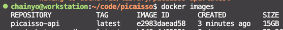

<div align="center">
  <h1>🎨 PicAIsso</h1>
  
  <p><em>PicAIsso: Bring AI art to your life.</em></p>
</div>

**PicAIsso** is an open-source StableDiffusion implementation for generating AI art using an API and a Discord Bot.

👉 _Imagine self-hosting your own MidJourney Discord bot, but with a different name and a different art style._

---

## Requirements

- [Docker](https://docs.docker.com/get-docker/) installed
- NVIDIA GPU with at least 16GB of VRAM
- NVIDIA drivers installed + [NVIDIA Container Toolkit](https://docs.nvidia.com/datacenter/cloud-native/container-toolkit/install-guide.html#docker) installed
- Linux based OS
> Please Windows users, go dual-boot, unfortunatly I don't have any experience with Windows and Docker.

## Installation

1. Clone the repository
```bash
git clone https://github.com/chainyo/picaisso.git
```

2. Create your own `.env` file for the API and update the values with your own. 
> Follow the `.env.template` comments.

3. Create your own `.env` file for the Discord Bot and update the values with your own. 
> Follow the `.env.template` comments. The Discord bot application is explained if you follow the link in the `.env.template` file.

4. (Optional) If you want to store the generated images, there is a S3 bucket configuration in the `.env` file. 
You can create your own S3 bucket and update the values with your own. Leave the values empty if you don't want to use S3.

## Deployment

There are two steps:
- Deploy the API
- Deploy the Discord Bot

**Warning:** Be sure to be in the root folder of the project before running the Docker commands.

### Deploy the API

1. Build the Docker image
```bash
docker build -t picaisso-api:latest -f docker/api/Dockerfile .
```

You should see the built image in your Docker images list, you can check it with the following command:
```bash
docker images
```


2. Run the Docker container
```bash
docker run -d \
  --gpus all \
  --name picaisso-api \
  -p 7680:7680 \
  -v ${HOME}/.cache:/root/.cache \
  --restart unless-stopped \
  picaisso-api:latest
```


## Usage

WIP...