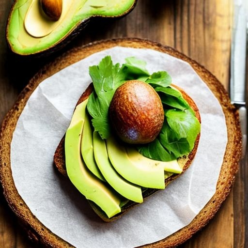

<div align="center">
  <h1>🎨 PicAIsso - Bring AI art to your life</h1>
  
</div>

**PicAIsso** is an open-source StableDiffusion implementation for generating AI art using an API and a Discord Bot.

👉 _Imagine self-hosting your own MidJourney Discord bot, but with a different name and a different art style._

---

You can self-host the API and the Discord bot on your own machine or on a server.

**OR**

You can use my own self-hosted API and Discord bot. Add the bot to your Discord server and start generating art! 🎉

> Click [here](https://discord.com/api/oauth2/authorize?client_id=1066110612272336936&permissions=35840&scope=bot) to invite the bot to your server.
> _Note: The bot is currently hosted on my own workstation, so it might be offline sometimes._ > _Note 2: I'm saving all the generated images on my S3 bucket, these images will be used to create a dataset available for free on Hugging Face._

For self-hosting instructions, keep reading the README. 👇

---

<div align="center">
  <h3>Some examples of generated images:</h3>
  <table>
    <tr>
      <td>
        
      </td>
      <td>
        
      </td>
    </tr>
    <tr>
      <td>
        
      </td>
      <td>
        
      </td>
    </tr>
  </table>
</div>

---

## Requirements

- [Docker](https://docs.docker.com/get-docker/) installed
- NVIDIA GPU with at least 12GB of VRAM (with a batch size of 1)
- NVIDIA drivers installed + [NVIDIA Container Toolkit](https://docs.nvidia.com/datacenter/cloud-native/container-toolkit/install-guide.html#docker) installed

## Installation

1. Clone the repository

```bash
git clone https://github.com/chainyo/picaisso.git
```

2. Create your own `.env` file for the API and update the values with your own.

   > Follow the `.env.template` comments.

3. Create your own `.env` file for the Discord Bot and update the values with your own.

   > Follow the `.env.template` comments.
   > The Discord bot application installation process is explained if you follow the link in the `.env.template` file.

4. (Optional) If you want to store the generated images, there is a S3 bucket configuration in the `.env` file.
   You can create your own S3 bucket and update the values with your own. Leave the values empty if you don't want to use S3.

## Deployment

There are two steps:

- Deploy the API
- Deploy the Discord Bot

**Warning:** Be sure to be in the root folder of the project before running the Docker commands.

### Create the Docker network

```bash
docker network create picaisso
```

### Deploy the API

1. Build the Docker image

```bash
docker build -t picaisso-api:latest -f docker/api/Dockerfile .
```

You should see the built image in your Docker images list, you can check it with the following command:

```bash
docker images
```


2. Run the Docker container

```bash
docker run -d \
  --gpus all \
  --network picaisso \
  -p 7681:7681 \
  -v ${HOME}/.cache:/root/.cache \
  --restart unless-stopped \
  --name picaisso-api \
  picaisso-api:latest
```

<!--
docker run -d --gpus all --network picaisso -p 7681:7681 -v ~/.cache:/root/.cache --restart unless-stopped --name picaisso-api picaisso-api:latest
-->

3. Test the API

The API should be running on port `7681` of your machine. It can take a few minutes to start, because the model has
to be downloaded and loaded on the first run. Because we are using the `${HOME}/.cache` folder as a mounted volume, the model will be downloaded only once and will be reused on the next runs.

Once the API is running, you can test it by going to `http://localhost:7681/` in your web browser.

You should see the landing page of the API.


Click on the `Docs` button to see the API documentation and test the `/generate` endpoint. Check the [Usage](##usage) section for more details.

_Trouble shooting: use the `docker logs picaisso-api` command to see the logs of the container._

### Deploy the Discord Bot

1. Build the Docker image

```bash
docker build -t picaisso-bot:latest -f docker/bot/Dockerfile .
```

2. Run the Docker container

```bash
docker run -d \
  --restart unless-stopped \
  --network picaisso \
  --name picaisso-bot \
  picaisso-bot:latest
```

<!--
docker run -d --restart unless-stopped --network picaisso --name picaisso-bot picaisso-bot:latest
-->

If you successfully created the Discord bot application, you just need to invite it to your server. You can find the invite link in the `OAuth2` section of your Discord bot application.
(See the tutorial link in the `.env.template` file.)

<!--
Which scopes does the bot need?
-->

Note: Server Members Intent must be enabled on the Discord bot (under the `Bot` section):


Mine is live! 🎉


## Usage

You can use the project in three different ways:

- Use the API documentation to generate images _(Starter apprentice level 🤓, be better than that)_
- Use the API endpoint to generate images _(Dev guru level 🧙‍♂️)_
- Use the Discord bot to generate images _(Discord bro level 🤙)_

### API documentation

For testing purposes, you can use the API documentation to generate images and validate everything is working
as expected. You can find the API documentation at `http://localhost:7681/docs` when the API is running.


1. Click on the `Authorize` button and enter your API key in the `Value` field.


2. Use the `generate` endpoint to generate an image.

2.1. Click on the `Try it out` button.


2.2. Enter the parameters you want to use to generate the image.


- _prompt: any text you want to use to generate the image._
- _author: the name of the author of the image. Used for s3 storage only, you can let string._

  2.3. Enter the `Execute` button and wait for the image to be generated.


You can download the image by right-clicking on the image and selecting `Save image as...`.

### API endpoint

You can use the API endpoint to generate images in your own application.

You can use the same logic used by the Discord bot to generate images. You can find the code in the `bot.py` file.

### Discord bot

You can use the Discord bot to generate images in your Discord server.

1. Start by typing `/art` in any channel of your Discord server.

2. The bot will ask you to enter the prompt you want to use to generate the image.

3. Enter the prompt you want to use to generate the image.


4. The bot will tell you the job is in progress and will send you the image when it's done.


Enjoy the result! 🎉


---

If you have any questions or issues, feel free to open an issue or contact me on [Twitter](https://twitter.com/chainyo_ai), Discord (ChainYo#3610) or via email (t.chaigneau.tc@gmail.com).

If you like the project, please consider giving it a ⭐️ and share it with your friends.

---

[Buy me a book](https://www.buymeacoffee.com/chainyo) 📚 if you want to support my work.
